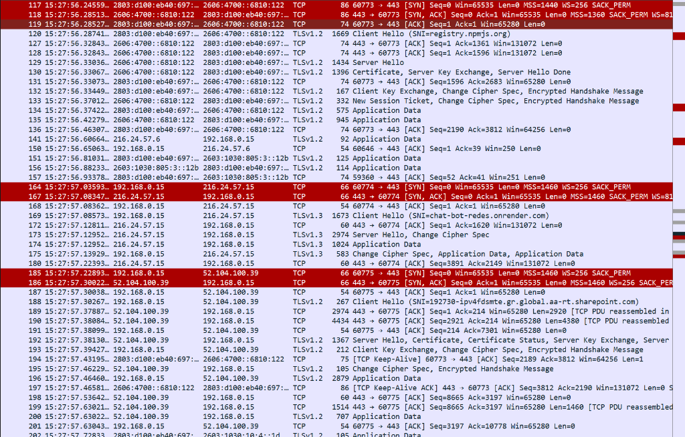
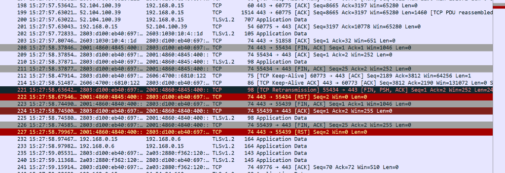
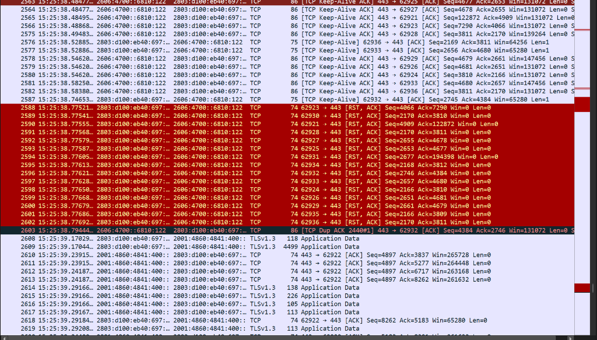

# Reporte Técnico: Servidores MCP, Wireshark y Análisis de Red
**Curso:** CC3067 Redes de Computadoras  
**Proyecto 1:** Uso de un protocolo existente (Model Context Protocol - JSON-RPC 2.0)  
**Estudiante:** Jonathan Morales  

---

## 1. Especificación de los Servidores MCP Desarrollados (Punto 8 del PDF)

### 1.1 Servidor MCP PharmaCare (Local y Remoto)
* **Nombre del Servidor:** `pharmacare-remote-mcp-server` / `pharmacare-mcp-server`
* **Versión:** `1.0.0`
* **Protocolo:** JSON-RPC 2.0
* **Transportes Soportados:**
  * **Local:** `stdio` (estándar de entrada y salida entre procesos).
  * **Remoto:** `HTTP POST` en el endpoint `/mcp` con `Content-Type: application/json`.
* **Endpoints HTTP (Modo Remoto):**
  * `POST /mcp`: Entrada principal para intercambio de mensajes JSON-RPC 2.0.
  * `GET /mcp`: Metadatos del servidor, versión y lista de herramientas expuestas.
  * `GET /health`: Health-check para balanceadores de carga y plataformas en la nube (Cloud Run, Render, etc.).

### 1.2 Catálogo de Herramientas (Tools)

#### A. `search_medications`
* **Descripción:** Búsqueda inteligente de medicamentos por síntoma, nombre o categoría médica.
* **Parámetros (`arguments`):**
  * `query` *(string, obligatorio)*: Término de búsqueda o síntoma del paciente (ej. `"fiebre"`, `"dolor de cabeza"`).
  * `category` *(string, opcional)*: Categoría médica para filtrar.
* **Respuesta (`result`):**
  * Objeto con `count` y arreglo de medicamentos coincidentes con ID, nombre, categoría, síntomas, precio y stock.

#### B. `check_inventory`
* **Descripción:** Consulta en tiempo real de disponibilidad de stock y precio unitario de un medicamento.
* **Parámetros (`arguments`):**
  * `medication_id` *(string, obligatorio)*: Código único del medicamento (ej. `"MED-001"`).
* **Respuesta (`result`):**
  * Estado de inventario, stock disponible, precio unitario en Quetzales (Q) e indicador si requiere receta médica.

#### C. `create_order`
* **Descripción:** Genera un pedido de compra a domicilio de uno o más medicamentos, validando stock y descontándolo de la base de datos.
* **Parámetros (`arguments`):**
  * `patient_name` *(string, obligatorio)*: Nombre completo del cliente.
  * `address` *(string, obligatorio)*: Dirección de entrega.
  * `items` *(array de objetos, obligatorio)*: Lista de `{ medication_id: string, quantity: number }`.
* **Respuesta (`result`):**
  * Resumen de la orden con ID generado (ej. `ORD-3833`), cliente, dirección, cantidad de productos, total calculado y estado `PENDING`.

#### D. `get_order_status`
* **Descripción:** Permite consultar el estado de despacho de una orden previamente realizada.
* **Parámetros (`arguments`):**
  * `order_id` *(string, obligatorio)*: ID de la orden generada (ej. `ORD-3833`).
* **Respuesta (`result`):**
  * Objeto con la información completa de la orden, fecha y estado actual.

---

## 2. Análisis de Comunicación con Wireshark (Puntos 7 y 9 del PDF)

### 2.1 Identificación de Mensajes JSON-RPC (Punto 7)

A continuación se detalla la clasificación de cada mensaje capturado en el flujo cliente-servidor:

| Tipo de Mensaje | Método JSON-RPC | ID | Dirección | Descripción |
| :--- | :--- | :---: | :---: | :--- |
| **Sincronización** (Handshake Req) | `initialize` | `1` | Cliente ➔ Servidor | Negociación de versión de protocolo (`2024-11-05`) y capacidades del cliente. |
| **Sincronización** (Handshake Res) | Respuesta a `initialize` | `1` | Servidor ➔ Cliente | Servidor confirma versión, capacidades y datos (`serverInfo`). |
| **Sincronización** (Handshake Notif) | `notifications/initialized` | *Ninguno* | Cliente ➔ Servidor | Notificación sin ID que finaliza el apretón de manos inicial. |
| **Solicitud (Petición)** | `tools/list` | `2` | Cliente ➔ Servidor | Petición para obtener el catálogo de herramientas disponibles. |
| **Respuesta** | Respuesta a `tools/list` | `2` | Servidor ➔ Cliente | Lista en formato JSON de las 4 herramientas con sus esquemas JSON Schema. |
| **Solicitud (Petición)** | `tools/call` (`search_medications`) | `3` | Cliente ➔ Servidor | Invocación de herramienta con parámetros (`query: "fiebre"` o `"dolor de cabeza"`). |
| **Respuesta** | Respuesta a `tools/call` | `3` | Servidor ➔ Cliente | Resultado con lista de medicamentos compatibles (`Paracetamol 500mg`) y precio. |
| **Solicitud (Petición)** | `tools/call` (`create_order`) | `4` | Cliente ➔ Servidor | Invocación de creación de orden con datos de paciente y productos. |
| **Respuesta** | Respuesta a `tools/call` | `4` | Servidor ➔ Cliente | Confirmación de la orden creada con ID y total. |

---

### 2.2 Evidencia Gráfica Capturada con Wireshark

A continuación se presentan las capturas reales obtenidas durante la ejecución de la prueba contra el servidor remoto desplegado en Render (`https://chat-bot-redes.onrender.com/mcp`):

#### Captura 1: Three-Way Handshake TCP y Negociación TLS con SNI en la Nube

**Análisis de los paquetes clave observados:**
* **Paquete 164:** `192.168.0.15 ➔ 216.24.57.15 [SYN]` (Puerto efímero cliente `60774` hacia puerto servidor `443`). Solicita la apertura de conexión TCP con número de secuencia inicial (`Seq=0`).
* **Paquete 167:** `216.24.57.15 ➔ 192.168.0.15 [SYN, ACK]` (Desde Render hacia el cliente). Acepta la conexión e incrementa el acuse de recibo (`Ack=1`).
* **Paquete 168:** `192.168.0.15 ➔ 216.24.57.15 [ACK]`. El cliente confirma. **Se completa exitosamente el Three-Way Handshake de la Capa de Transporte.**
* **Paquete 169:** `TLSv1.3 Client Hello (SNI=chat-bot-redes.onrender.com)`. **Mensaje de Sincronización Inicial**: El cliente solicita establecer la sesión segura hacia el host remoto específico `chat-bot-redes.onrender.com`.
* **Paquete 173:** `TLSv1.3 Server Hello, Change Cipher Spec`. Render responde acordando la suite criptográfica segura TLSv1.3.
* **Paquetes 174 y 175:** `TLSv1.3 Application Data`. **Mensajes de Solicitud y Respuesta MCP**: Intercambio de las tramas cifradas JSON-RPC 2.0 conteniendo `initialize` y la respuesta del catálogo de herramientas (`tools/list`).

---

#### Captura 2: Flujo de Carga Útil (Application Data) y Cierre de Conexión

**Análisis de los paquetes observados:**
* **Paquetes 198 a 201:** Flujo bidireccional continuo de segmentos TCP con acuses de recibo (`ACK`) y números de ventana adaptativos (`Win=65280`) garantizando el control de flujo entre el host y el servidor en la nube.
* **Paquetes 208 a 227:** Intercambio de banderas `[FIN, ACK]` y `[RST]` de la capa de transporte al finalizar la ejecución del script de prueba y desconectar la sesión MCP de forma limpia.

---

#### Captura 3: Inspección de Paquetes Application Data TLSv1.3

**Análisis de los paquetes observados:**
* **Paquetes 2608 a 2619:** Se evidencian las tramas de datos de aplicación (`Application Data`) de longitud variable (ej. 4499 bytes, 138 bytes, 226 bytes) correspondientes a las cargas útiles de las respuestas con los listados de medicamentos en formato JSON.

### 2.3 Explicación del Tráfico por Capas del Modelo OSI / TCP-IP (Punto 9)

#### 1. Capa de Enlace de Datos (Data Link Layer)
* **Unidad de Datos:** Trama Ethernet (Ethernet II Frame).
* **Función observada en Wireshark:**
  * Transporta los paquetes IP entre la tarjeta de red del anfitrión y el router/gateway.
  * **Direcciones MAC:** Se observan la dirección MAC física de origen (NIC local) y la dirección MAC de destino (gateway por defecto o interfaz de bucle invertido/loopback).
  * **EtherType:** Campo fijado en `0x0800`, indicando que la trama encapsula un paquete IPv4.
  * **CRC / FCS:** Control de redundancia para verificar que la trama no sufrió errores en el medio físico.

#### 2. Capa de Red (Network / Internet Layer)
* **Unidad de Datos:** Paquete IPv4.
* **Función observada en Wireshark:**
  * Encargada del direccionamiento lógico y enrutamiento extremo a extremo.
  * **Dirección IP Origen:** IP del anfitrión (ej. `192.168.1.X` o `127.0.0.1` en pruebas locales).
  * **Dirección IP Destino:** IP del servidor remoto desplegado en la nube o local.
  * **Protocolo:** Campo con valor `6`, indicando que transporta un segmento TCP.
  * **Time to Live (TTL):** Evita que los paquetes circulen indefinidamente en caso de bucles de enrutamiento.

#### 3. Capa de Transporte (Transport Layer)
* **Unidad de Datos:** Segmento TCP (Transmission Control Protocol).
* **Función observada en Wireshark:**
  * Garantiza la entrega confiable, ordenada y sin pérdidas de los datos mediante:
    1. **Three-Way Handshake (Establecimiento de conexión):**
       * Cliente envía `[SYN]` con un número de secuencia inicial (ISN).
       * Servidor responde `[SYN, ACK]`.
       * Cliente confirma con `[ACK]`.
    2. **Puertos:**
       * **Puerto Origen:** Puerto efímero asignado por el sistema operativo (ej. `54321`).
       * **Puerto Destino:** Puerto de escucha del servidor (`8080` para HTTP local o `443` para HTTPS remoto).
    3. **Control de Flujo y Fiabilidad:** Números de secuencia (`Seq`), números de reconocimiento (`Ack`) y tamaño de ventana (`Window Size`) para evitar sobrecargar al receptor.
    4. **Cierre de Conexión:** Intercambio de banderas `[FIN, ACK]` o reuso de conexión HTTP Keep-Alive.

#### 4. Capa de Aplicación (Application Layer)
* **Protocolos:** HTTP/1.1 y JSON-RPC 2.0.
* **Función observada en Wireshark:**
  * **HTTP POST:** El cliente envía peticiones HTTP con método `POST /mcp`, cabeceras `Host`, `Content-Type: application/json` y `Content-Length`.
  * **HTTP 200 OK:** El servidor remoto procesa la petición y responde con código de estado `200 OK`.
  * **Carga Útil (Payload JSON-RPC 2.0):**
    * Cada cuerpo HTTP contiene un objeto JSON válido con la especificación `jsonrpc: "2.0"`.
    * En las peticiones se observan los campos `method`, `params` y el identificador correlacionador `id`.
    * En las respuestas se observa el mismo `id` junto con el bloque `result` o `error`.

---

## 3. Conclusiones y Comentarios sobre el Proyecto (Punto 10 del PDF)

1. **Interoperabilidad mediante Protocolos Estándar:** La adopción del Model Context Protocol (MCP) demuestra cómo un formato común basado en JSON-RPC desacopla completamente el modelo de lenguaje (anfitrión) de las fuentes de datos y acciones del mundo real (servidores MCP), permitiendo integrar herramientas tanto locales como en la nube con la misma interfaz.
2. **Implementación Manual sin SDKs:** Implementar el protocolo JSON-RPC 2.0 de manera manual permitió comprender a profundidad la estructura de mensajes (solicitudes, respuestas, notificaciones y errores), los mecanismos de sincronización mediante apretón de manos inicial y el manejo de correlación de peticiones mediante identificadores (`id`).
3. **Visibilidad de Red:** El análisis con Wireshark evidenció de forma práctica el viaje de los datos a través de la pila TCP/IP: desde el empaquetado de las tramas Ethernet hasta la semántica de la capa de aplicación con HTTP y JSON-RPC, corroborando el principio de encapsulación de redes.
